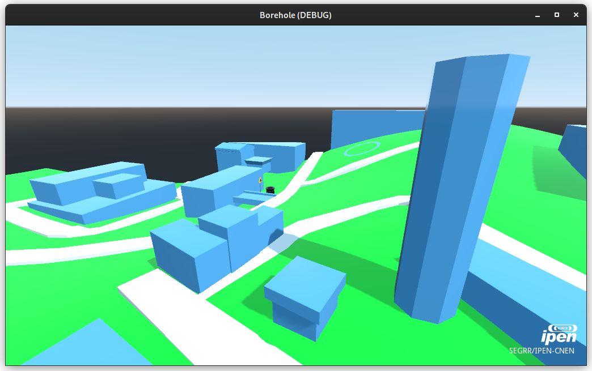

# Borehole for disposal of Disused Sealed Radioactive Sources

Radioactive sources are known for remaining active for a very long period. Some will present high levels of radioactivity for thousands of years, even after their working life. Knowing most sources are highly radiotoxic, we need a solution for storing and keeping them safe until they present no threat to human life or the environment.

In this project, we explore the concept of a borehole disposal facility proposed by the IAEA. The goal is to develop a computational tool for modeling the physical processes and features that might happen to a facility. In addition to modeling, we aim to create a tool for visualizing the physical elements and effects of this borehole well.

## Built with

The development of this project is done with game engines and 3D modeling software.

- Godot Engine
- Blender 3D

## Contribuitors

- [Ícaro Vaz Freire](https://ivfreire.github.io/en) - *Physics BSc student at USP and intern at IPEN/CNEN* - icaro.f@ipen.br
- [Victor Keichi Tsutsumiuchi](https://twitter.com/nukechu) - *Nuclear Physics PhD student at IPEN/CNEN*
- [Roberto Vicente](http://lattes.cnpq.br/9314928031812405) - *Nuclear Technology PhD and professor at IPEN/CNEN* - rvicente@ipen.br

## Acknowledgements

- [IPEN](https://www.ipen.br) - *Institute of Energy and Nuclear Research*
- [CNEN](https://www.gov.br/cnen/pt-br) - *Brazilian National Comission for Nuclear Energy*
- [IAEA](https://www.iaea.org/) - *International Atomic Energy Agency*
